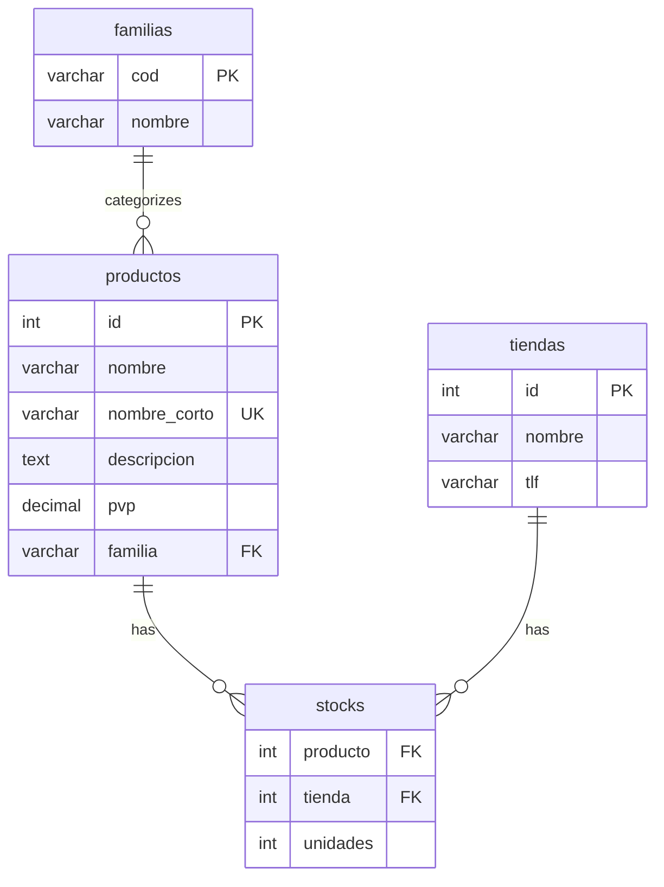

## Database Design Overview

The **proyecto** database is a product management system that demonstrates proper relational database design with multiple tables, foreign keys, and relationships.

<Note>
This schema is used throughout TEMA-04 exercises and represents a real-world inventory management system.
</Note>

## Database Schema

The proyecto database consists of four main tables:



## Creating the Database

<Steps>
  <Step title="Create Database">
    First, create the database with proper character set:
    
    ```sql
    CREATE DATABASE proyecto 
    DEFAULT CHARACTER SET utf8mb4 
    COLLATE utf8mb4_unicode_ci;
    
    USE proyecto;
    ```
  </Step>
  
  <Step title="Create Tables">
    Create tables in the correct order (parent tables before child tables).
  </Step>
  
  <Step title="Create Database User">
    Set up a dedicated user with appropriate permissions.
  </Step>
  
  <Step title="Grant Permissions">
    Assign the necessary privileges to the database user.
  </Step>
</Steps>

## Complete SQL Schema

Here's the complete schema from `proyecto.sql`:

<CodeGroup>
```sql proyecto.sql
-- 1.- Creamos la Base de Datos
CREATE DATABASE proyecto DEFAULT CHARACTER SET utf8mb4 COLLATE utf8mb4_unicode_ci;
USE proyecto;

-- 2.- Creamos las tablas

-- 2.1.1.- Tabla tienda
CREATE TABLE IF NOT EXISTS tiendas(
    id INT AUTO_INCREMENT PRIMARY KEY,
    nombre VARCHAR(100) NOT NULL,
    tlf VARCHAR(13) NULL
);

-- 2.1.2.- Tabla familia
CREATE TABLE IF NOT EXISTS familias(
    cod VARCHAR(6) PRIMARY KEY,
    nombre VARCHAR(200) NOT NULL
);

-- 2.1.3.- Tabla producto
CREATE TABLE IF NOT EXISTS productos(
    id INT AUTO_INCREMENT PRIMARY KEY,
    nombre VARCHAR(200) NOT NULL,
    nombre_corto VARCHAR(50) UNIQUE NOT NULL,
    descripcion TEXT NULL,
    pvp DECIMAL(10, 2) NOT NULL,
    familia VARCHAR(6) NOT NULL,
    CONSTRAINT fk_prod_fam FOREIGN KEY(familia) 
        REFERENCES familias(cod) 
        ON UPDATE CASCADE 
        ON DELETE CASCADE
);

-- 2.1.4.- Tabla stocks
CREATE TABLE IF NOT EXISTS stocks(
    producto INT,
    tienda INT,
    unidades INT UNSIGNED NOT NULL,
    CONSTRAINT pk_stock PRIMARY KEY(producto, tienda),
    CONSTRAINT fk_stock_prod FOREIGN KEY(producto) 
        REFERENCES productos(id) 
        ON UPDATE CASCADE 
        ON DELETE CASCADE,
    CONSTRAINT fk_stock_tienda FOREIGN KEY(tienda) 
        REFERENCES tiendas(id) 
        ON UPDATE CASCADE 
        ON DELETE CASCADE
);

-- 3.- Creamos un usuario
CREATE USER gestor@'localhost' IDENTIFIED BY "secreto";

-- 4.- Le damos permiso en la base de datos "proyecto"
GRANT ALL ON proyecto.* TO gestor@'localhost';
```

```sql Insert Sample Data
-- Tabla familias
INSERT INTO familias VALUES 
    ('CAMARA','Cámaras digitales'),
    ('CONSOL','Consolas'),
    ('EBOOK','Libros electrónicos'),
    ('IMPRES','Impresoras'),
    ('ORDENA','Ordenadores'),
    ('PORTAT','Ordenadores portátiles');

-- Tabla tiendas 
INSERT INTO tiendas VALUES 
    (1,'CENTRAL','600100100'),
    (2,'SUCURSAL1','600100200'),
    (3,'SUCURSAL2',NULL);

-- Tabla productos
INSERT INTO productos VALUES 
    (1,'Nintendo 3DS negro','3DSNG','Consola portátil de Nintendo',270.00,'CONSOL'),
    (2,'Acer AX3950 I5-650 4GB 1TB W7HP','ACERAX3950','Ordenador de sobremesa',410.00,'ORDENA');

-- Tabla stocks
INSERT INTO stocks VALUES 
    (1,1,2),
    (1,2,1),
    (2,1,1);
```
</CodeGroup>

## Table Details

### Productos (Products)

Stores product information with the following structure:

| Column | Type | Constraints | Description |
|--------|------|-------------|-------------|
| `id` | INT | PRIMARY KEY, AUTO_INCREMENT | Unique product identifier |
| `nombre` | VARCHAR(200) | NOT NULL | Full product name |
| `nombre_corto` | VARCHAR(50) | UNIQUE, NOT NULL | Short code for product |
| `descripcion` | TEXT | NULL | Detailed product description |
| `pvp` | DECIMAL(10,2) | NOT NULL | Retail price |
| `familia` | VARCHAR(6) | FOREIGN KEY | Product category |

### Familias (Categories)

Defines product categories:

| Column | Type | Constraints | Description |
|--------|------|-------------|-------------|
| `cod` | VARCHAR(6) | PRIMARY KEY | Category code |
| `nombre` | VARCHAR(200) | NOT NULL | Category name |

### Tiendas (Stores)

Stores information about retail locations:

| Column | Type | Constraints | Description |
|--------|------|-------------|-------------|
| `id` | INT | PRIMARY KEY, AUTO_INCREMENT | Store identifier |
| `nombre` | VARCHAR(100) | NOT NULL | Store name |
| `tlf` | VARCHAR(13) | NULL | Phone number |

### Stocks (Inventory)

Tracks product quantities at each store:

| Column | Type | Constraints | Description |
|--------|------|-------------|-------------|
| `producto` | INT | PRIMARY KEY, FOREIGN KEY | Product ID |
| `tienda` | INT | PRIMARY KEY, FOREIGN KEY | Store ID |
| `unidades` | INT UNSIGNED | NOT NULL | Available units |

<Warning>
The `stocks` table uses a composite primary key consisting of both `producto` and `tienda`, meaning each product-store combination must be unique.
</Warning>

## Foreign Key Relationships

The schema implements referential integrity through foreign keys:

### Cascade Behavior

All foreign keys use `ON UPDATE CASCADE` and `ON DELETE CASCADE`:

```sql
CONSTRAINT fk_prod_fam FOREIGN KEY(familia) 
    REFERENCES familias(cod) 
    ON UPDATE CASCADE 
    ON DELETE CASCADE
```

**What this means:**

- **ON UPDATE CASCADE**: If a familia code changes, all related productos update automatically
- **ON DELETE CASCADE**: If a familia is deleted, all related productos are also deleted

<Note>
Cascade operations maintain data integrity but should be used carefully. Deleting a familia will delete all products in that category!
</Note>

## Database User Setup

Creating a dedicated database user with minimal necessary privileges:

```sql
-- Create user
CREATE USER gestor@'localhost' IDENTIFIED BY "secreto";

-- Grant privileges only on proyecto database
GRANT ALL ON proyecto.* TO gestor@'localhost';
```

<Steps>
  <Step title="User Scope">
    The `@'localhost'` specifies the user can only connect from the local machine.
  </Step>
  
  <Step title="Minimal Privileges">
    Grant only necessary privileges. In production, avoid `GRANT ALL` and specify exact permissions (SELECT, INSERT, UPDATE, DELETE).
  </Step>
  
  <Step title="Strong Passwords">
    Use strong passwords in production. Never use simple passwords like "secreto".
  </Step>
</Steps>

## Connecting to MySQL from PHP

Once the database is set up, connect using the PDO configuration:

```php
<?php
require_once 'conexion.php';

// $conProyecto is now available for queries
```

See [PDO Introduction](/database/pdo-introduction) for connection details.

## Data Types Best Practices

### DECIMAL for Money

```sql
pvp DECIMAL(10, 2) NOT NULL
```

<Warning>
Always use DECIMAL for monetary values, never FLOAT or DOUBLE, to avoid rounding errors.
</Warning>

### VARCHAR vs TEXT

- Use `VARCHAR` with specific length for fields with known limits (names, codes)
- Use `TEXT` for longer content without fixed length (descriptions)

### Character Encoding

```sql
DEFAULT CHARACTER SET utf8mb4 COLLATE utf8mb4_unicode_ci
```

`utf8mb4` supports all Unicode characters including emojis and special symbols.

## Verifying the Schema

After creating the database, verify the structure:

```sql
-- Show all tables
SHOW TABLES;

-- Describe a table structure
DESCRIBE productos;

-- View foreign key constraints
SHOW CREATE TABLE productos;
```

## Common Schema Patterns

### Auto-Increment Primary Keys

```sql
id INT AUTO_INCREMENT PRIMARY KEY
```

Used for `productos` and `tiendas` tables. MySQL automatically assigns unique IDs.

### Composite Primary Keys

```sql
CONSTRAINT pk_stock PRIMARY KEY(producto, tienda)
```

Used for `stocks` table to ensure each product-store combination is unique.

### String Primary Keys

```sql
cod VARCHAR(6) PRIMARY KEY
```

Used for `familias` table. Useful for human-readable identifiers.

## Next Steps

With your database schema in place, you're ready to:

- Implement [CRUD Operations](/database/crud-operations) to manage data
- Learn [Advanced Queries](/database/advanced-queries) for complex data retrieval
- Review [PDO Introduction](/database/pdo-introduction) for connection basics